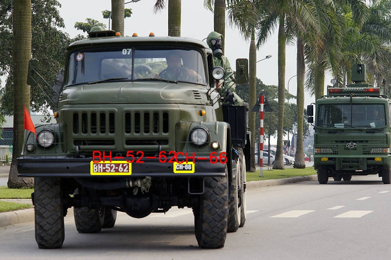

# TonAI Text Recognition
### A simple OCR Python library
Try on <a href="http://huggingface.co/spaces/tungedng2710/TonAI-OCR"></a> space

  

Text detection with text recognition


Vietnam military vehicle license plate


## Installation
install via PyPi
```
pip install ton-ocr
```
## Usage example

```
import cv2
import numpy as np
from ton_ocr import TonOCRPipeline

image_path = "stuffs/example.jpg"
image = cv2.imread(image_path)
ocr = TonOCRPipeline()
results = ocr.predict(image)

for result in results:
    bbox = result.box           # text bounding box
    text = result.text          # text string
    score = result.score        # OCR's confidence
    img = result.img            # cropped text image

    # Draw the bounding polygon
    points = np.array(bbox, np.int32)
    points = points.reshape((-1, 1, 2))
    color = (0, 255, 255)
    is_closed = True
    thickness = 2
    cv2.polylines(image, [points], is_closed, color, thickness)

    # Add OCR text to the image
    font = cv2.FONT_HERSHEY_SIMPLEX
    font_scale = 1
    text_color = (0, 0, 255)
    text_thickness = 2
    first_point = tuple(points[0][0])
    cv2.putText(image, text, first_point, font, font_scale, text_color, text_thickness)

cv2.imshow('Image Window', image)
cv2.waitKey(0)
cv2.destroyAllWindows()
```
